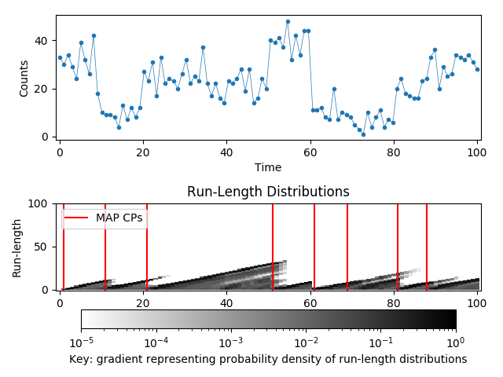

# bayesian-online-changepoint-detection-for-multivariate-point-processes

## Abstract

Bayesian On-line Changepoint Detection (CPD) is an active area of research in machine learning used as a tool to model structural changes that occur within ill-behaved, complex data generating processes. It has numerous applications in finance, health, and ecology. The goal of CPD is to detect abrupt changes in a time-series by partitioning it into identifiable sub-sequences; where the boundaries between two partitions are called changepoints (CP). Unlike previous Bayesian approaches in modelling CPs, on-line inference can be achieved by placing efficient prior beliefs over CPs to achieve a linear time and space complexity. In more recent developments of the state-of-the-art, model selection is proposed to solve problems such as model misspecification.

This thesis extends the Bayesian On-line CPD forefront by proposing a special model class for count data known as the Log Gaussian Cox Process, which falls under the realms of nonparametric Bayesian methods. We study the many attractive properties of this model including flexibility, and discuss various approximation methods to overcome issues in intractability. Next,we attempt to speed-up the model using sparse approximations; and extend this to multivariate streams. To benchmark the performance of this model, we apply it on two real-world and one synthetic dataset.

## Directory

      .
      ├── BOCPDMPP_Slides.pdf     # Summary of project in slides
      ├── BOCPDMPP_V2_0.pdf       # Full thesis on BOCPDMPP
      ├── BVAR_NIG.py
      ├── BVAR_NIG_DPD.py
      ├── Evaluation_tool.py
      ├── LGCP_test.py
      ├── cp_probability_model.py
      ├── detector.py
      ├── example_data
      ├── generate_data.py
      ├── lgcp_model.py           # Univariate Log Gaussian Cox Process
      ├── mlgcp_model.py          # Multivariate Log Gaussian Cox Process
      ├── multinomial_dirichlet_model.py
      ├── nearestPD.py
      ├── poisson_gamma_model.py
      ├── probability_model.py
      └── r_distr_plot.py

## Installation

Create a virtual environment
```bash
virtualenv venv
source venv/bin/activate
```

Install requirements via pip
```bash
pip install -r requirements.txt
```

## Usage

To run BOCPD algorithm
```python
python LGCP_test.py
```

## Demo


